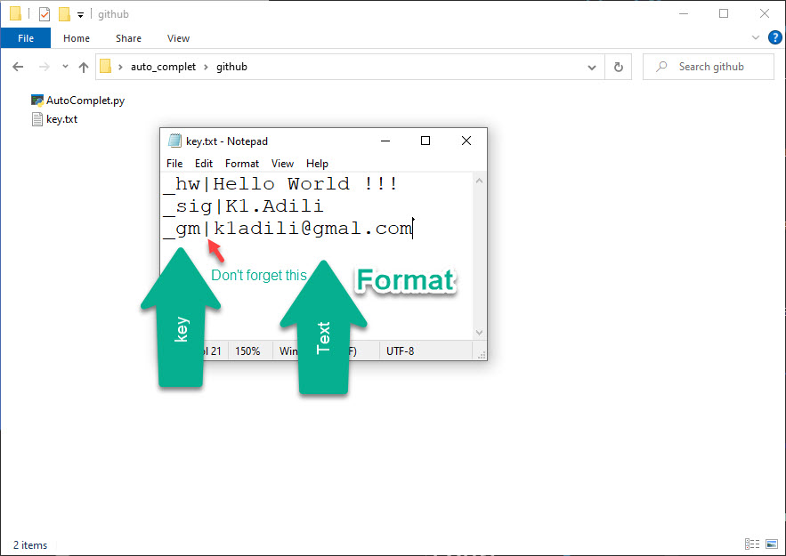

# auto complete text
Auto Complet Text
For those who type repetitive texts
For programmers and complete repetitive code
By using this program, you increase the speed of content creation
You just have to enter the desired key with | Separate from the desired text and put <key.txt> in the file

